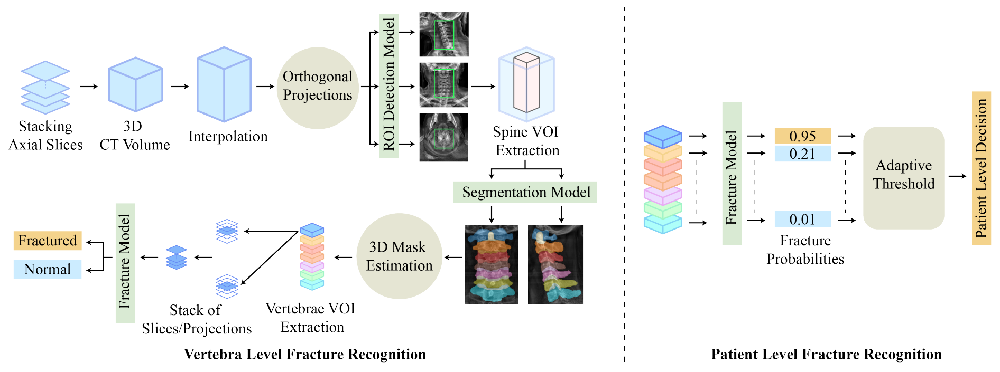
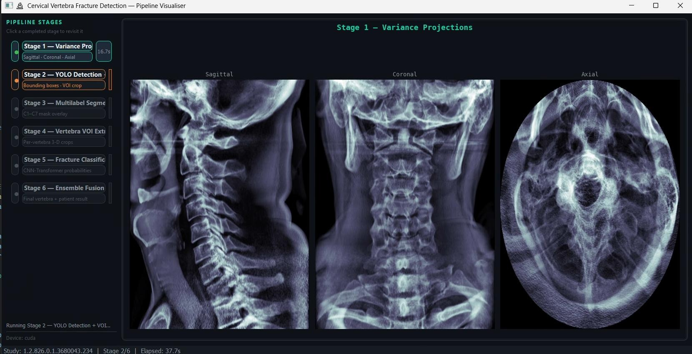
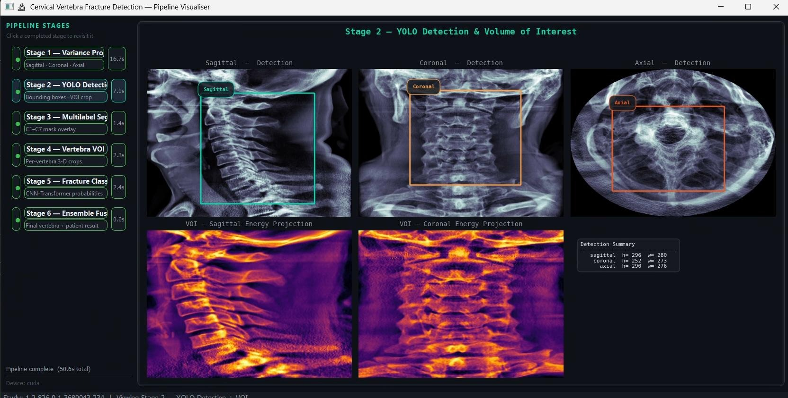
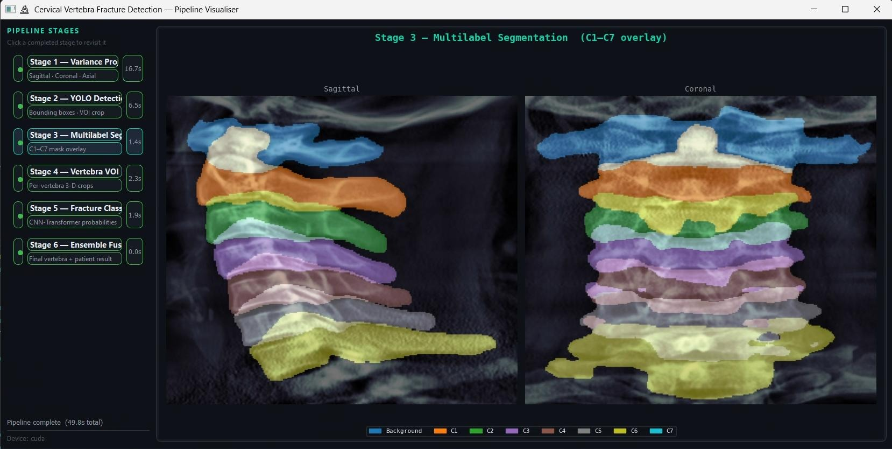
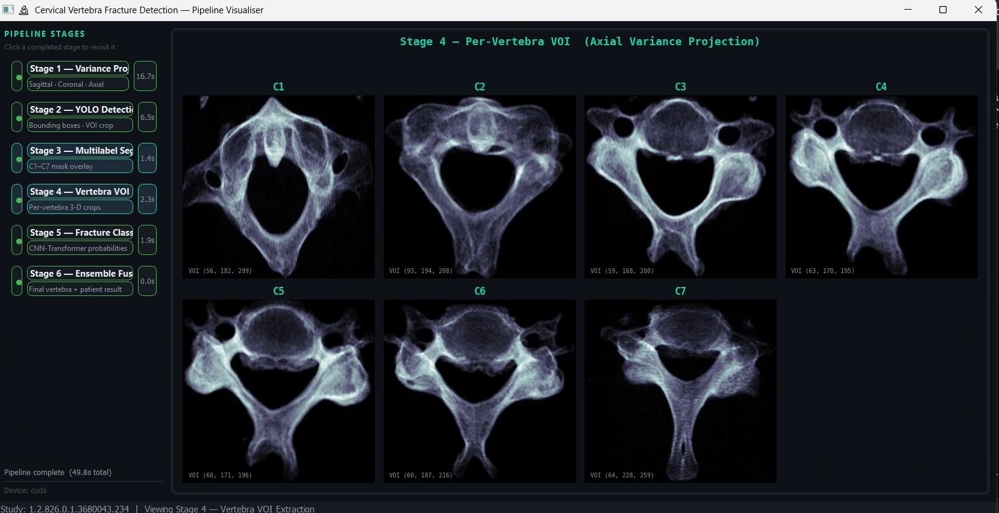
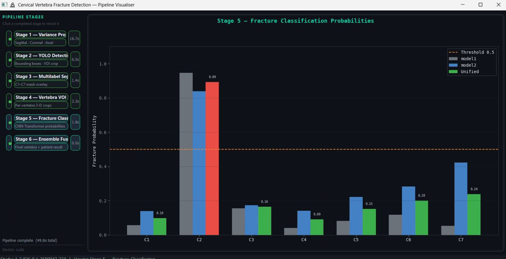
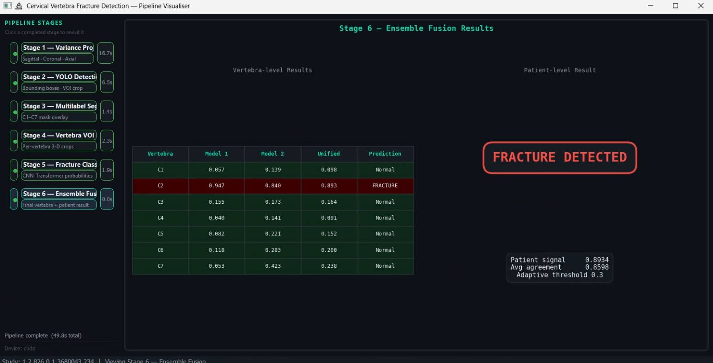

<div align="center">

# Tracing 3D Anatomy in 2D Strokes

### A Multi-Stage Projection-Driven Approach to Cervical Spine Fracture Identification

[](https://arxiv.org/abs/2601.15235)
[](https://opensource.org/licenses/MIT)
[](https://www.python.org/downloads/)
[](https://pytorch.org/)

[Paper](https://arxiv.org/abs/2601.15235) • [Weights & Data](https://drive.google.com/drive/folders/1IXJYOVUrWsZqV3n2BKXotOfgk6Vsl3x9?usp=sharing) • [Dataset](https://www.kaggle.com/competitions/rsna-2022-cervical-spine-fracture-detection)

</div>

---

## 🔬 Overview

This repository provides the official implementation for detecting cervical vertebra (C1–C7) fractures from CT volumes using a novel **projection-driven pipeline**. Instead of relying on full 3D segmentation networks, we approximate 3D vertebra volumes through optimized 2D axial, sagittal, and coronal projections—reducing the problem dimensionality while preserving the anatomical context necessary for accurate fracture identification.

<div align="center">

</div>

### Key Contributions

- **Projection-Driven VOI Extraction**: Traces 3D cervical anatomy using variance and energy-based 2D projections, reconstructing approximate 3D vertebra masks from 2D localization and multi-label segmentation
- **2.5D Spatio-Sequential CNN-Transformer**: A novel ensemble architecture that captures spatial and sequential context across vertebra volumes for fracture classification
- **Dimensionality Reduction**: Reformulates 3D segmentation as a 2D projection problem, offering an alternative pathway that sidesteps dense volumetric processing
- **Clinical Validation**: Inter-observer study with three expert radiologists using Cohen's κ and Fleiss' κ to benchmark model performance against human readers
- **Clinical Realism**: Validated on the highly imbalanced RSNA 2022 dataset without artificial balancing

---

## 📊 Performance

Evaluated on the [RSNA 2022 Cervical Spine Fracture Detection](https://www.kaggle.com/competitions/rsna-2022-cervical-spine-fracture-detection) dataset using **5-fold patient-wise cross-validation**:

| Metric | Score |
|--------|-------|
| **Patient-Level F1** | 82.26 |
| **Vertebra-Level F1** | 68.15 |

---

## 👨‍⚕️ Clinical Validation

A key component of this work is the **inter-observer agreement study** comparing model predictions against expert radiologist assessments.

### Expert Panel

| Radiologist | Role & Affiliation |
|-------------|-------------------|
| [Dr. Adam Mushtak](https://scholar.google.com/citations?user=1s3pZBQAAAAJ&hl=en) | Diagnostic Radiologist at Hamad Medical Corporation |
| [Dr. Israa Al-Hashimi](https://scholar.google.com/citations?user=f1XBd0QAAAAJ&hl=en) | Radiology Resident at Hamad Medical Corporation |
| [Dr. Sohaib Bassam Zoghoul](https://scholar.google.com/citations?user=3ZvCHjoAAAAJ&hl=en) | Diagnostic and Interventional Radiologist at Hamad Medical Corporation |

### Agreement Metrics

- **Cohen's Kappa (κ)**: Pairwise agreement between model and each individual radiologist
- **Fleiss' Kappa (κ)**: Multi-rater agreement across all three radiologists and the model

This inter-observer analysis contextualizes model performance within the inherent variability of expert human readers, providing clinically meaningful benchmarks beyond standard machine learning metrics.

---

## 🏗️ Pipeline Architecture

```
CT Volume (DICOM)
       │
       ▼
┌──────────────────────────────────────────────────────────────┐
│  Stage 1  │  Variance Projections (Sagittal/Coronal/Axial)   │
│  Stage 2  │  YOLO Detection → Volume of Interest (VOI) Crop  │
│  Stage 3  │  Multi-label U-Net Segmentation (C1–C7 Masks)    │
│  Stage 4  │  Per-Vertebra 3D VOI Extraction                  │
│  Stage 5  │  CNN-Transformer Fracture Classification         │
│  Stage 6  │  Ensemble Fusion → Patient-Level Prediction      │
└──────────────────────────────────────────────────────────────┘
       │
       ▼
Vertebra-Level Probabilities + Patient-Level Prediction
```

| Stage | Description | Output |
|-------|-------------|--------|
| **1** | Generate variance-based projections across three orthogonal planes | 2D projection images |
| **2** | Detect cervical spine ROI using YOLOv8 | Cropped VOI volume |
| **3** | Multi-label semantic segmentation of C1–C7 | Per-vertebra 2D masks |
| **4** | Reconstruct 3D vertebra volumes from 2D masks | Individual vertebra VOIs |
| **5** | Classify each vertebra using 2.5D CNN-Transformer | Fracture probabilities |
| **6** | Fuse predictions via adaptive ensemble | Final diagnosis |

---

## 🖥️ Visualization Dashboard

An interactive Qt-based dashboard visualizes every stage of the pipeline in real-time. Click any completed stage in the sidebar to inspect its outputs.

```bash
python visualize.py --dicom-dir "ct_volumes/your_study_id"
```

<div align="center">

<table>
<tr>
<td align="center" width="50%">
<br/>
<b>Stage 1: Variance Projections</b><br/>
<em>Generates variance-based 2D projections across sagittal, coronal, and axial planes</em>
</td>
<td align="center" width="50%">
<br/>
<b>Stage 2: VOI Detection</b><br/>
<em>YOLOv8 localizes the cervical spine region and crops the VOI</em>
</td>
</tr>
<tr>
<td align="center">
<br/>
<b>Stage 3: Multi-label Segmentation</b><br/>
<em>U-Net segments individual vertebrae (C1–C7) in 2D projections</em>
</td>
<td align="center">
<br/>
<b>Stage 4: Per-Vertebra VOI Extraction</b><br/>
<em>Reconstructs 3D vertebra volumes from 2D segmentation masks</em>
</td>
</tr>
<tr>
<td align="center">
<br/>
<b>Stage 5: Fracture Classification</b><br/>
<em>2.5D CNN-Transformer classifies each vertebra for fracture presence</em>
</td>
<td align="center">
<br/>
<b>Stage 6: Ensemble Fusion</b><br/>
<em>Adaptive fusion produces vertebra-level and patient-level predictions</em>
</td>
</tr>
</table>

</div>

---

## 📁 Repository Structure

```
├── config.py                 # Paths and hyperparameters (configure here)
├── model.py                  # CNN-Transformer architecture definition
├── utils.py                  # DICOM I/O and preprocessing utilities
├── run.py                    # CLI inference entry point
├── visualize.py              # Interactive Qt-based visualization dashboard
├── requirements.txt          # Python dependencies
│
├── scripts/                  # Modular stage implementations
│   ├── stage1_projections.py
│   ├── stage2_voi.py
│   ├── stage3_segmentation.py
│   ├── stage4_vertebra_vois.py
│   ├── stage5_classification.py
│   └── stage6_ensemble.py
│
├── weights/                  # Pretrained model weights (download separately)
├── ct_volumes/               # Input DICOM studies (one folder per study)
├── results/                  # Final predictions (created at runtime)
├── intermediates/            # Stage outputs (with --save-intermediates)
└── assets/                   # Documentation figures
```

---

## ⚙️ Installation

### Requirements

- Python 3.11+
- CUDA 11.8+ (for GPU acceleration)
- ~8GB GPU memory recommended

### Setup

```bash
# Clone the repository
git clone https://github.com/fabinahian/cervical_spine_fracture_identification.git
cd cervical_spine_fracture_identification

# Create virtual environment (recommended)
python -m venv venv
source venv/bin/activate  # Linux/macOS
# or: venv\Scripts\activate  # Windows

# Install dependencies
pip install -r requirements.txt
```

### Download Pretrained Weights

Download the pretrained weights and sample DICOM data from Google Drive:

**[⬇️ Download Weights & Sample Data](https://drive.google.com/drive/folders/1IXJYOVUrWsZqV3n2BKXotOfgk6Vsl3x9?usp=sharing)**

Place the contents into the `weights/` and `ct_volumes/` directories respectively.

---

## Usage

### 1. Configure Paths

Edit `config.py` to set your study directory:

```python
DICOM_DIR = r"ct_volumes/your_study_id"
```

### 2. Run Inference

```bash
# Basic inference (uses DICOM_DIR from config.py)
python run.py

# Specify study directory at runtime
python run.py --dicom-dir "ct_volumes/your_study_id"

# Save all intermediate outputs for inspection
python run.py --dicom-dir "ct_volumes/your_study_id" --save-intermediates

# Enable verbose logging
python run.py --verbose
```

---

## 📤 Output Format

### Final Results

Results are saved to `results/{study_id}_result.npy`:

```python
import numpy as np

result = np.load("results/your_study_id_result.npy", allow_pickle=True).item()

# Structure:
{
    "study_id": "...",
    "vertebra": {
        "C1": {"p1": 0.12, "p2": 0.15, "unified_score": 0.13, "prediction": 0},
        "C2": {"p1": 0.08, "p2": 0.11, "unified_score": 0.09, "prediction": 0},
        # ... C3 through C6 ...
        "C7": {"p1": 0.71, "p2": 0.75, "unified_score": 0.73, "prediction": 1}
    },
    "patient": {
        "patient_signal":     0.73,    # Maximum vertebra score
        "avg_agreement":      0.91,    # Model agreement metric
        "adaptive_threshold": 0.30,    # Decision threshold
        "prediction":         1        # 1 = fracture detected, 0 = no fracture
    }
}

# Quick access to patient-level prediction
print(f"Fracture Detected: {bool(result['patient']['prediction'])}")
```

### Intermediate Outputs

When using `--save-intermediates`, additional outputs are saved:

```
intermediates/{study_id}/
├── projections/          # Stage 1 — Variance projection PNGs
├── voi/                  # Stage 2 — VOI volume (.npy) + energy projections
├── seg_masks/            # Stage 3 — Multi-label segmentation masks (.npy)
├── vertebra_vois/        # Stage 4 — Per-vertebra crop volumes (.npy)
└── cls_results.npy       # Stage 5 — Raw per-model probabilities
```

---

## 📚 Dataset

This work uses the [RSNA 2022 Cervical Spine Fracture Detection](https://www.kaggle.com/competitions/rsna-2022-cervical-spine-fracture-detection) dataset:

- **Total Cases**: 2,019 CT studies for classification
- **Annotated Subset**: 87 cases with voxel-level vertebra masks (used for ROI detection and segmentation stages)
- **Labels**: Patient-level and vertebra-level (C1–C7) fracture annotations
- **Characteristics**: Highly imbalanced, multi-center, variable acquisition protocols

---

## 🔍 Methodology Highlights

### Why Projections Instead of 3D Segmentation?

Traditional approaches rely on 3D segmentation networks that operate directly on volumetric data. Our key insight is that **optimized 2D projections** (variance and energy-based) can capture sufficient anatomical information to:

1. Localize the cervical spine region
2. Segment individual vertebrae (C1–C7)
3. Approximate 3D vertebra volumes for downstream classification

By reformulating the problem through 2D projections, we reduce dimensionality while retaining the spatial relationships necessary for accurate vertebra delineation—offering an alternative to dense 3D processing pipelines.

### 2.5D Spatio-Sequential Architecture

Our fracture classifier combines:
- **Spatial features** from 2D CNN encoders processing axial slices
- **Sequential context** via Transformer modules that model inter-slice dependencies
- **Ensemble fusion** across complementary model variants for robust predictions

### Inter-Observer Benchmarking

To contextualize automated performance, we conducted an inter-observer study where three expert radiologists independently assessed fracture presence. Model predictions were compared against each reader using Cohen's κ and across all raters using Fleiss' κ, situating algorithmic accuracy within the spectrum of human expert variability.

---

## 📝 Citation

If you find this work useful, please cite:

```bibtex
@article{madhurja2025cervical,
  title   = {Tracing 3D Anatomy in 2D Strokes: A Multi-Stage Projection-Driven 
             Approach to Cervical Spine Fracture Identification},
  author  = {Madhurja, Fabi Nahian and Sarmun, Rusab and Chowdhury, Muhammad E. H. 
             and Mushtak, Adam and Al-Hashimi, Israa and Zoghoul, Sohaib Bassam},
  journal = {arXiv preprint arXiv:2601.15235},
  year    = {2025},
  url     = {https://arxiv.org/abs/2601.15235}
}
```

---

## 🙏 Acknowledgments

- [RSNA](https://www.rsna.org/) for organizing the 2022 Cervical Spine Fracture Detection competition and providing the dataset
- **Dr. Adam Mushtak**, **Dr. Israa Al-Hashimi**, and **Dr. Sohaib Bassam Zoghoul** from Hamad Medical Corporation for their expert radiological assessments in the inter-observer study
- The medical imaging community for foundational work in spine analysis

---

## 📄 License

This project is licensed under the MIT License — see [LICENSE](LICENSE) for details.

---

<div align="center">

**Questions or Issues?** Please open an [issue](https://github.com/fabinahian/cervical_spine_fracture_identification/issues) on GitHub.

</div>